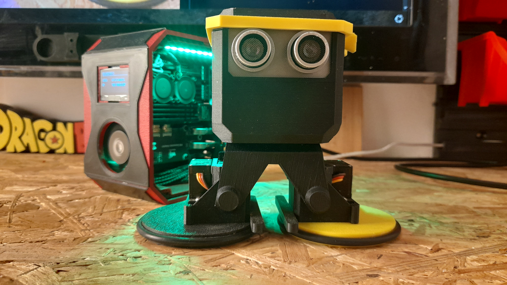

# OttoNinja ESP8266 Access Point Controller

This repository contains the ESP8266 firmware that creates its own WiFi hotspot, allowing direct control of the Otto Ninja robot without requiring an existing WiFi network. This is the second part of the Otto Ninja control system.

This project consists of two parts:

- **Python Control Interface** - [OttoNinjaServoDriver](https://github.com/boryspimpek/OttoNinjaServoDriver) - Web interface and movement logic  
- **ESP8266 Access Point Firmware** - This repository - Standalone WiFi hotspot mode

## Project concept

The core idea behind this project is to offload all servo control to the ESP8266, while keeping the entire decision-making and logic layer in Python.

This architecture brings a few key benefits:

Fast development – You can modify and test your Python logic instantly, without reflashing the microcontroller.

Separation of concerns – The ESP8266 acts purely as a low-level actuator controller (“muscles”), while Python handles the higher-level behavior and intelligence (“brain”).

Flexible updates – All changes to walking patterns, movement sequences, or reactions can be done from the Python side.

Think of it as:
Wemos = Muscles, 
Python = Brain
  
## Inspiration and Basis of This Project

This project is based on the original [OttoNinja](https://github.com/OttoDIY/OttoNinja) by OttoDIY.  
I deeply admire the original author for the incredible amount of work and dedication put into that project.

My repository builds upon and customizes those solutions, using the ESP8266 and a custom Wi-Fi servo control implementation.

Many thanks to the original creators for the inspiration and excellent foundation!

## Disclaimer

I’m just a hobbyist and self-taught developer. This project is a personal experiment and learning journey, so please keep in mind that the code and design might not follow professional standards. Use it as inspiration or a starting point rather than a polished, production-ready solution.

## Project Architecture

The system uses a distributed architecture:

| Component       | Role                       |
|-----------------|----------------------------|
| ESP8266 (This repo) | "Muscles" - Low-level servo control + WiFi hotspot |
| Python (Other repo)  | "Brain" - Movement logic + web interface |

---

## ⚡ Key Features

- 📡 Self-contained hotspot - No need for existing WiFi network  
- 🔌 UDP Communication - Fast, lightweight servo control  
- 🎯 Plug & Play - Just connect to the robot's WiFi and start controlling  
- 🚀 Instant setup - Works anywhere, anytime  
- 🛡️ Isolated network - Dedicated connection for robot control

---

## 🛠️ Hardware Requirements

| Component | Description                  |
|-----------|------------------------------|
| Controller| Wemos D1 Mini (ESP8266)      |
| Servos    | 2x Standard (LL, RL) + 2x Continuous (LF, RF) |
| Power     | 5V power supply              |

---

## 📌 Wiring Diagram

| Servo          | ESP8266 Pin | Type            |
|----------------|-------------|-----------------|
| LL (Left Leg)  | D1          | Standard (0-180°) |
| LF (Left Foot) | D2          | Continuous (360°) |
| RL (Right Leg) | D5          | Standard (0-180°) |
| RF (Right Foot)| D6          | Continuous (360°) |

---

## 🚀 Quick Start

1. **Flash the ESP8266 Firmware**  
   - Install Arduino IDE  
   - Add ESP8266 board support via Boards Manager  
   - Open the sketch from this repository  
   - Upload to your Wemos D1 Mini

2. **Connect to Robot's Hotspot**  
   After flashing, the ESP8266 will create a WiFi hotspot:  
   - **Network Name:** `ESP8266-Robot`  
   - **Password:** `12345678`  
   - **Robot IP:** `192.168.4.1`  
   - **UDP Port:** `4210`

3. **Install Python Controller**  
   Head over to the Python Control Repository [OttoNinjaServoDriver](https://github.com/boryspimpek/OttoNinjaServoDriver) and follow the installation instructions there.
---

## 📄 License

This project is licensed under the [Creative Commons Attribution-ShareAlike 4.0 International License](https://creativecommons.org/licenses/by-sa/4.0/).

You are free to use, modify, and redistribute this work, as long as:

- You give appropriate credit to the original authors  
- You include a link to the [Otto DIY website](https://ottodiy.com)  
- Any remixes or adaptations are released under the same CC-BY-SA license

---

🤖 Ready to bring your Otto robot to life? Flash this firmware and start the wireless adventure!
